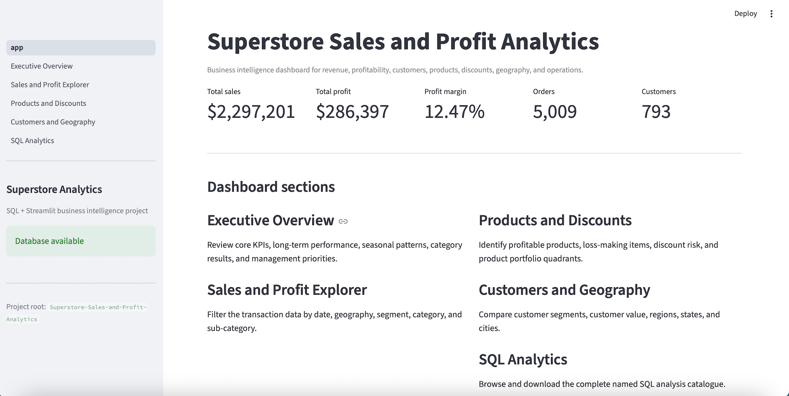
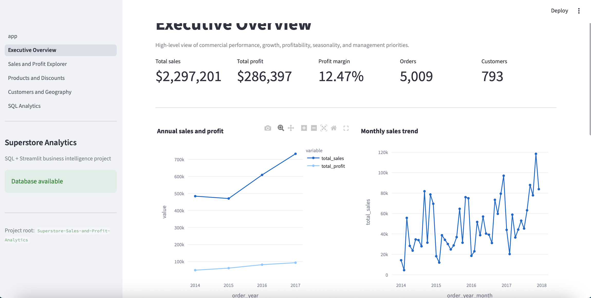
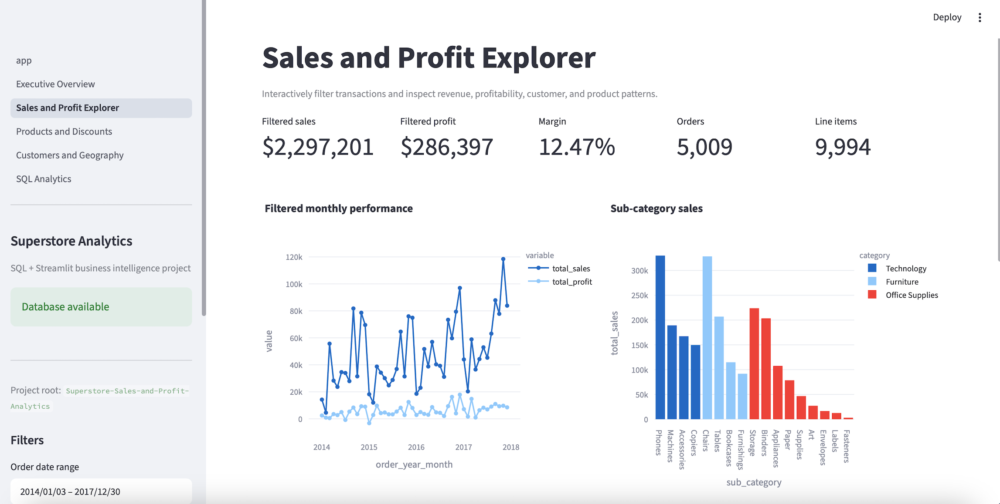
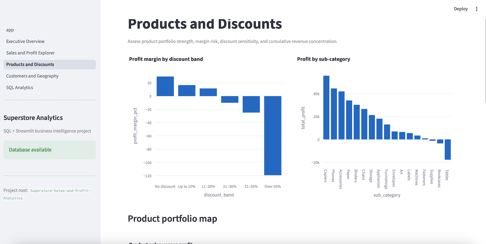
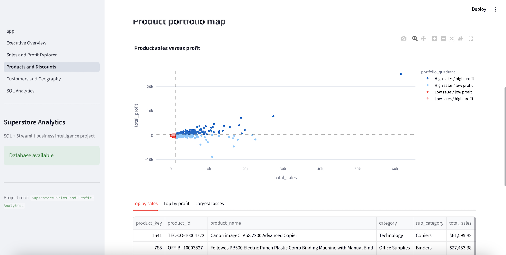
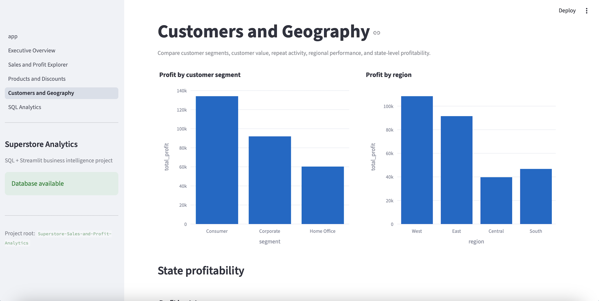
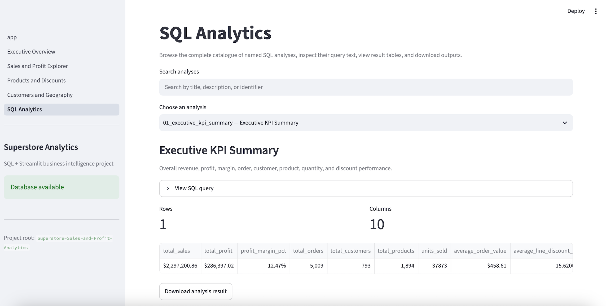

# 📊 Superstore Sales and Profit Analytics

> **End-to-End Business Intelligence & Analytics Engineering Project**

A production-inspired business intelligence project built around the **Sample Superstore** dataset. This repository demonstrates the complete analytics lifecycle—from raw transactional data through ETL, feature engineering, relational database design, SQL analytics, automated reporting, and an interactive Streamlit dashboard.

The goal of this project is not only to analyze sales data, but also to demonstrate modern **data analyst**, **business intelligence**, and **analytics engineering** practices using Python, SQL, SQLite, and Streamlit.

---

## Dashboard Preview

### Dashboard Home



---

## Project Highlights

- ✅ Automated ETL and preprocessing pipeline
- ✅ Feature engineering and data validation
- ✅ Normalized SQLite data warehouse
- ✅ Analytical SQL views
- ✅ 30 reusable SQL business analyses
- ✅ Automated CSV report generation
- ✅ Interactive multi-page Streamlit dashboard
- ✅ Comprehensive unit testing with Pytest
- ✅ Modular, production-inspired project structure

---

# Business Problem

Organizations collect large amounts of transactional sales data, but turning those data into actionable business insights requires a structured analytics workflow.

This project answers questions such as:

- Which product categories generate the most profit?
- Which discounts improve sales but reduce profitability?
- Which customers generate the highest business value?
- Which geographical markets perform best?
- Which products lose money?
- How has performance evolved over time?
- Which business areas require management attention?

---

# Dataset

**Dataset:** Sample Superstore

The dataset contains approximately:

| Metric | Value |
|---------|-------:|
| Order line items | 9,994 |
| Orders | 5,009 |
| Customers | 793 |
| Products | 1,894 |
| Locations | 632 |

Variables include:

- Sales
- Profit
- Quantity
- Discount
- Customers
- Products
- Categories
- Geography
- Shipping
- Order dates

---

# Project Architecture

```text
Raw CSV Data
      │
      ▼
Data Cleaning & Validation
      │
      ▼
Feature Engineering
      │
      ▼
Normalized SQLite Database
      │
      ▼
SQL Views
      │
      ▼
30 SQL Business Analyses
      │
      ▼
CSV Report Generation
      │
      ▼
Interactive Streamlit Dashboard
```

---

# Repository Structure

```text
Superstore-Sales-and-Profit-Analytics/

├── app/
│   ├── app.py
│   ├── utils.py
│   └── pages/
│
├── artifacts/
├── data/
│   ├── raw/
│   ├── processed/
│   ├── database/
│   └── dashboard/
│
├── images/
├── notebooks/
├── reports/
├── scripts/
├── sql/
├── src/
│   └── superstore_analytics/
├── tests/
│
├── pyproject.toml
├── requirements.txt
└── README.md
```

---

# Data Pipeline

The project contains a fully reproducible preprocessing pipeline.

Main stages include:

- Raw data loading
- Data cleaning
- Missing value handling
- Data validation
- Feature engineering
- Processed dataset export
- Data quality reporting

Engineered features include:

- Shipping days
- Profit margin
- Unit sales
- Unit profit
- Discount bands
- Discount indicators
- Time-based features
- Loss-making transaction flags

---

# SQLite Data Warehouse

The processed data are transformed into a normalized SQLite database.

Main tables:

- Customers
- Products
- Locations
- Orders
- Order Items

The warehouse includes:

- Primary keys
- Foreign keys
- Indexes
- Analytical views
- Integrity validation

The final validation confirms:

- Correct row counts
- Referential integrity
- Zero foreign-key violations
- Successful analytical view creation

---

# SQL Analytics Catalogue

The repository contains **30 reusable SQL analyses** covering:

- Executive KPIs
- Sales trends
- Profit trends
- Quarterly performance
- Monthly seasonality
- Category analysis
- Sub-category performance
- Product portfolio analysis
- Pareto analysis
- Discount analysis
- Customer segmentation
- Customer profitability
- Geographic performance
- Shipping analysis
- Order value distribution
- Management summary

Each analysis can be executed automatically and exported as a CSV report.

---

# Streamlit Dashboard

The project includes a fully interactive business intelligence dashboard.

---

## Executive Overview



The Executive Overview provides:

- Executive KPIs
- Annual sales trends
- Monthly performance
- Category profitability
- Regional profitability
- Management summary

---

## Sales & Profit Explorer



Interactive functionality includes:

- Date filtering
- Geography filtering
- Segment filtering
- Category filtering
- Sub-category filtering
- Interactive Plotly charts
- Downloadable transaction data

---

## Products & Discounts



This section analyzes:

- Product profitability
- Discount effectiveness
- Portfolio quadrants
- High-performing products
- Loss-making products

### Product Portfolio Map



Products are automatically classified into strategic portfolio quadrants based on their sales and profitability.

---

## Customers & Geography



Business analyses include:

- Customer segments
- Regional performance
- State profitability
- Customer value
- High-value customers
- Geographic comparisons

---

## SQL Analytics Browser



Every SQL analysis can be:

- Browsed
- Searched
- Executed
- Viewed
- Downloaded

directly inside the dashboard.

---

# Technologies

## Programming

- Python

## Data Analysis

- Pandas
- NumPy

## Database

- SQLite
- SQL

## Visualization

- Plotly
- Streamlit

## Testing

- Pytest

---

# Running the Project

## 1. Clone the repository

```bash
git clone https://github.com/PontusBjorkell/Superstore-Sales-and-Profit-Analytics.git
cd Superstore-Sales-and-Profit-Analytics
```

---

## 2. Install dependencies

```bash
pip install -r requirements.txt
```

---

## 3. Prepare the data

```bash
python scripts/prepare_data.py
```

---

## 4. Build the database

```bash
python scripts/build_database.py
```

---

## 5. Execute all SQL analyses

```bash
python scripts/run_analysis.py
```

---

## 6. Launch the dashboard

```bash
streamlit run app/app.py
```

---

# Testing

Run the complete automated test suite:

```bash
pytest -v
```

The tests validate:

- Data preprocessing
- Feature engineering
- Database construction
- SQL analytics
- Validation reports

---

# Key Business Insights

Examples of insights produced by the project include:

- Technology generated the highest sales.
- Copiers were the most profitable product sub-category.
- Tables produced the largest cumulative losses.
- Heavy discounting substantially reduced profit margins.
- Regional profitability varied considerably across the United States.
- Product portfolio analysis identified high-performing and underperforming products.
- Customer profitability differed significantly across market segments.

---

# Skills Demonstrated

This repository demonstrates practical experience with:

- Business Intelligence
- Data Analytics
- Analytics Engineering
- SQL
- Database Design
- ETL Pipelines
- Feature Engineering
- Streamlit
- Plotly
- Dashboard Development
- Software Engineering
- Testing
- Reproducible Data Pipelines

---

# Future Improvements

Potential future extensions include:

- Streamlit Community Cloud deployment
- CI/CD with GitHub Actions
- Docker support
- Interactive geographical maps
- Forecasting models
- Additional executive dashboards

---

# License

This project is intended for educational and portfolio purposes.